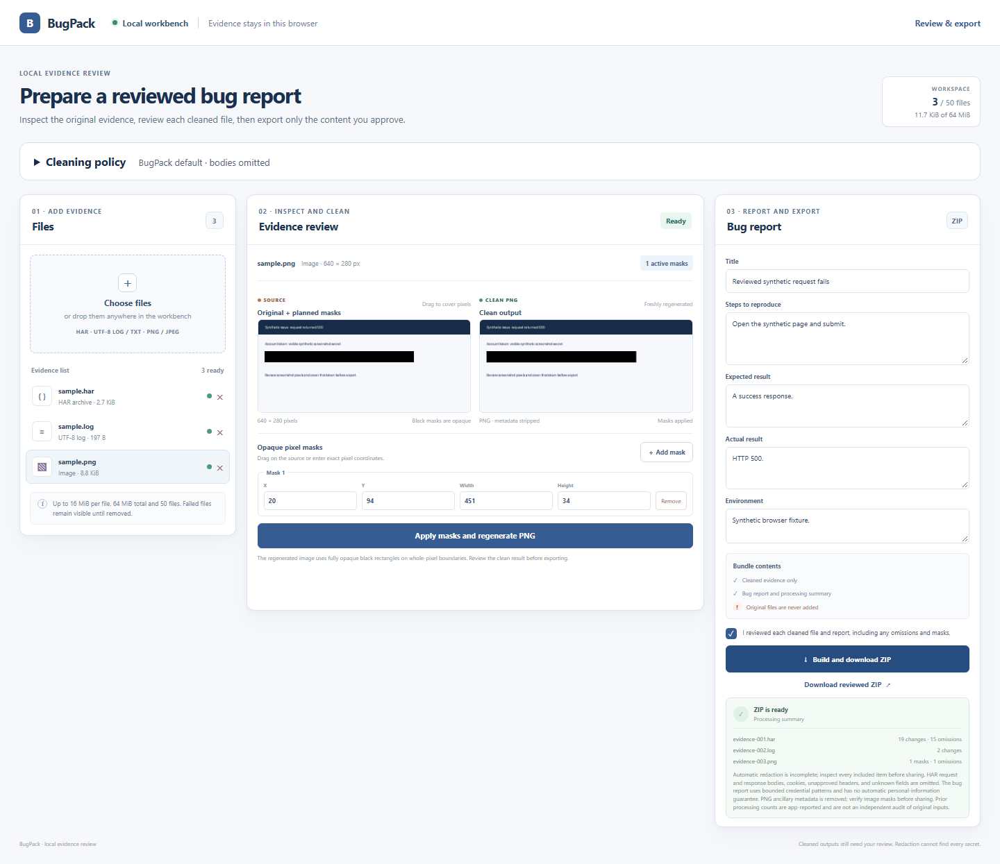

# BugPack

Inspect debugging evidence locally, remove sensitive values, and share a reviewed ZIP containing clean files and a bug report.

BugPack is for developers and support teams who need to share a HAR, log or screenshot without attaching its original credentials and metadata. [Download a portable package](https://github.com/Pastalikek65/bugpack/releases). It runs locally without an account, upload backend, paid API or remote model. Each release includes SHA-256 checksums and `verification.json` identifying its exact source, tested platforms and limitations. The [1.0.0 verification record](docs/verification.md#stable-100-release) summarizes its qualification scope. The 1.0.0 archives predate this documentation update; use their `verification.json` and `SHA256SUMS` for the exact archive identities and records. This later documentation commit does not alter or requalify those archives.



See the [actual processing summary](examples/outputs/processing-summary.json) and [generated Markdown report](examples/outputs/bug-report.md). These files come from the real browser acceptance, not a mockup.

[](https://github.com/Pastalikek65/bugpack/actions/workflows/ci.yml)

## First report

Requires Node.js 24 and a current Chromium browser on Windows or Linux x64.

Extract the downloaded archive and run `start.cmd` on Windows or `./start.sh` on Linux. Open the printed localhost address. Files stay on your computer. If port 4174 is occupied, use `node scripts/serve.mjs --root web --port 4175` from the package directory.

To run from source:

```sh
npm ci
npm run build
node scripts/serve.mjs --root dist --port 4174
```

Open `http://127.0.0.1:4174`. Choose `examples/sample.har`, `sample.log` and `sample.png`. Review **Original text** beside the editable clean copy. Remove the example email manually: automatic patterns do not find every personal value. On the screenshot, cover the highlighted token with an opaque mask, then choose **Apply masks and regenerate PNG**. Complete the report fields, review every clean file, and choose **Build and download ZIP**.

The ZIP contains neutral `evidence-*` filenames, a Markdown report and `processing-summary.json`. Originals and original filenames are not included automatically. The default omits HAR bodies, cookies, unapproved headers and unknown extension fields and counts them in the summary. All input files remain unchanged.

The **Cleaning policy** panel adds reusable policy files, literal replacement rules and opt-in JSON/form body cleanup. Applying a policy rebuilds text from its originals and requires a fresh review. For repeatable HAR/log processing, the package includes a CLI using the same cleanup engine:

```sh
node cli/bugpack.mjs doctor --json
node cli/bugpack.mjs clean --kind har --input request.har --out request-clean.har
node cli/bugpack.mjs bundle --har request-clean.har --log app.log --out reviewed.zip --reviewed
```

Create the output directory first; existing files are never overwritten. Review the final ZIP and complete the generated report before sharing. See the [CLI guide](docs/cli.md) for policies, batch inputs and report fields. Images require the browser workbench.

[Türkçe hızlı başlangıç](docs/quickstart.tr.md) · [Supported inputs and limits](docs/support.md) · [Architecture](docs/architecture.md) · [Roadmap](docs/roadmap.md)

[Performance measurement](docs/performance.md) documents the repeatable synthetic CLI workload and the scope of its process-memory figures.

## Review before sharing

Known authorization, cookie, credential assignment and signed-URL patterns are removed automatically. The cleaned text is editable. Screenshot masks cover whole pixels with opaque black; outputs are newly encoded PNGs without ancillary metadata. Original previews remain local and can contain secrets. Inspect URLs, names, text, pixels and the report before sharing. BugPack does not guarantee detection of every secret or personal value.

A failed input blocks export until it is removed. Editing evidence, report fields or masks invalidates the review acknowledgement. File processing and ZIP creation run in dedicated workers with explicit cancellation and deadlines.

## Development

```sh
npm test
npm run typecheck
npm run build
npx playwright install chromium
node scripts/acceptance.mjs
node scripts/acceptance-policy.mjs
node scripts/acceptance-cli.mjs
```

The acceptance harnesses use real Chromium, workers, downloads, CLI subprocesses, ZIP inspection and decoded PNG pixel checks. Synthetic fixture bytes are bound by `examples/manifest.json`; the displayed example's provenance is recorded beside its outputs. See [verification](docs/verification.md) for evidence and qualification scope. The app uses Apache-2.0; bundled third-party licenses and the dependency inventory are in [third_party](third_party/README.md).
